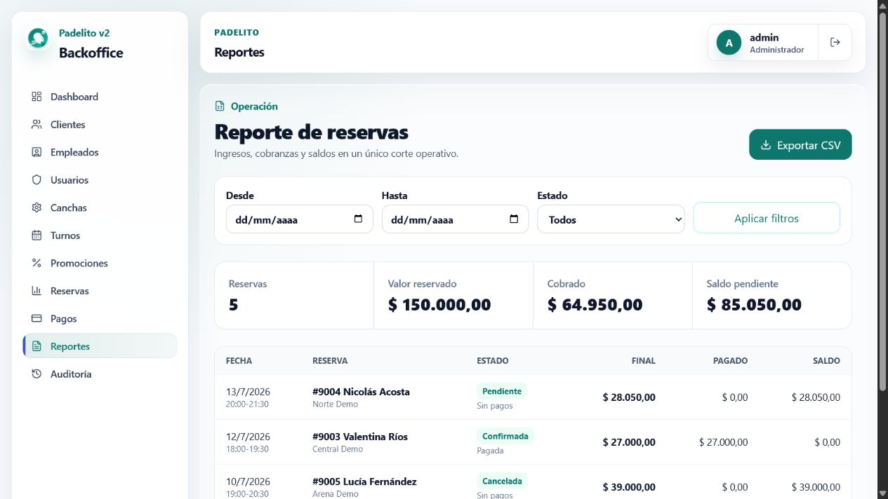
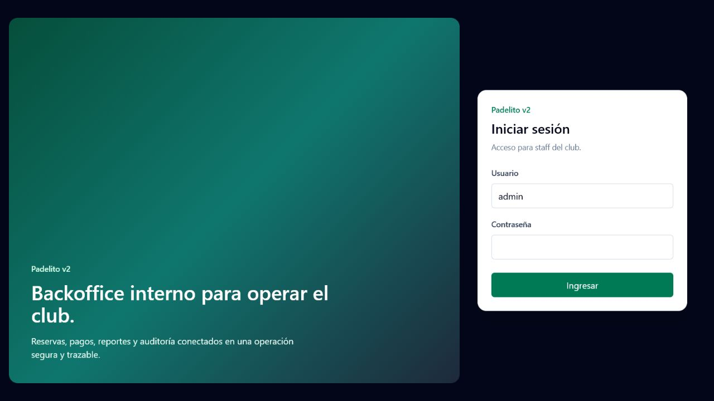
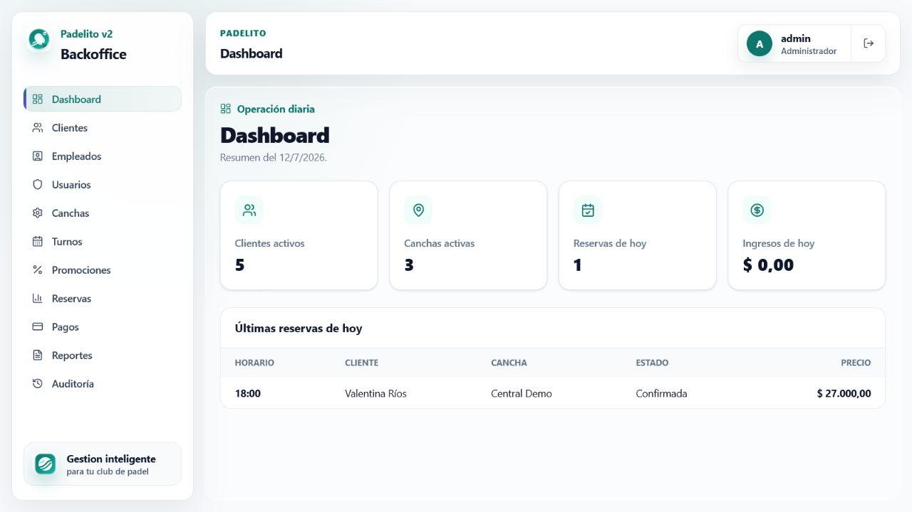
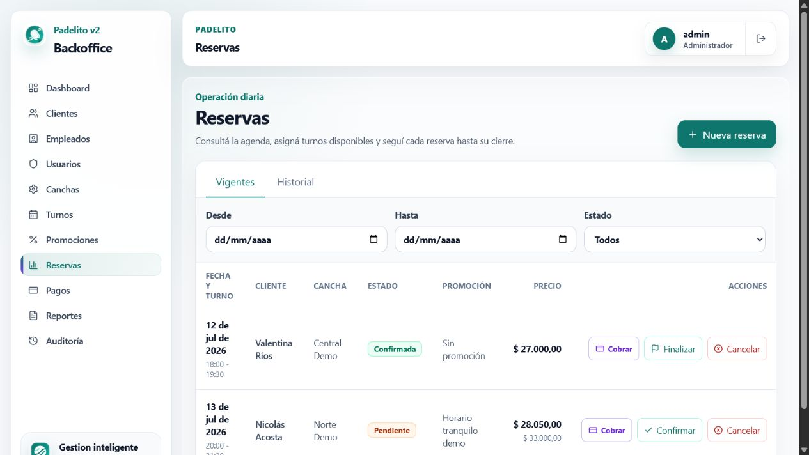
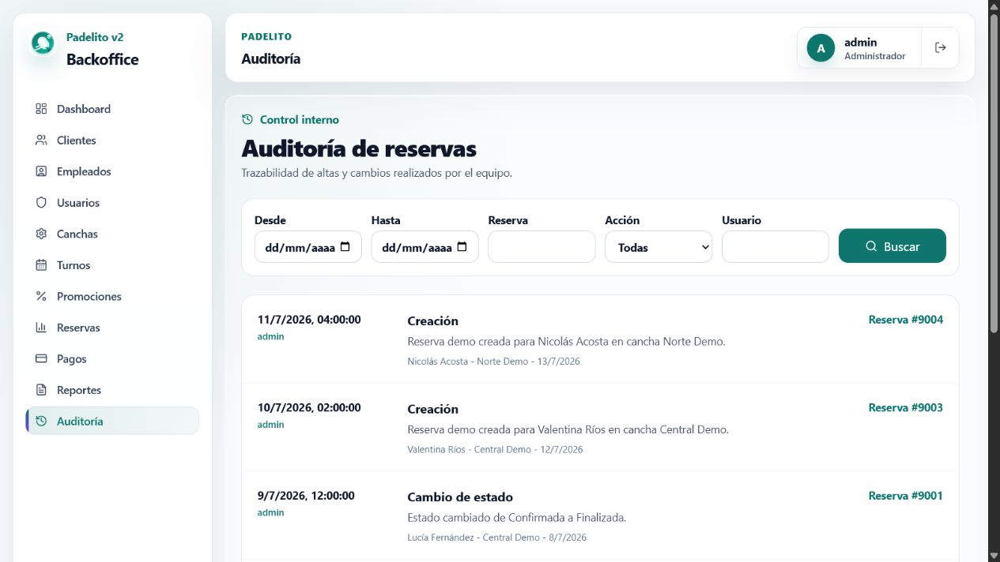

# Padelito v2

Sistema web de gestión interna para clubes de pádel. Centraliza clientes, canchas, turnos, promociones, reservas, pagos, reportes y auditoría en un backoffice protegido por roles.



## Funcionalidades

- Autenticación JWT con contraseñas hasheadas y permisos por rol.
- Gestión de clientes, empleados, usuarios, canchas, turnos y promociones.
- Reservas con disponibilidad, prevención de doble ocupación, cálculo por duración y descuentos.
- Estados de reserva controlados y trazabilidad de cada cambio.
- Pagos parciales o totales con prevención transaccional de sobrepagos.
- Dashboard diario con métricas y últimas reservas.
- Reporte por fechas y estado con totales reservados, cobrados y pendientes.
- Exportación CSV UTF-8 compatible con Excel.
- Auditoría administrativa por fecha, reserva, acción y usuario.

## Recorrido visual

| Acceso seguro | Operación diaria |
| --- | --- |
|  |  |

| Reservas | Auditoría |
| --- | --- |
|  |  |

## Stack y arquitectura

El backend usa .NET 10, ASP.NET Core Web API, Entity Framework Core y SQL Server. Está separado en cuatro proyectos:

- `Padelito.Domain`: entidades y constantes del dominio.
- `Padelito.Application`: DTOs, servicios, validaciones e interfaces.
- `Padelito.Infrastructure`: DbContext, repositorios, migraciones y seed.
- `Padelito.Api`: controllers, JWT, autorización, CORS, Swagger y composición de dependencias.

El frontend es una SPA con React 19, TypeScript, Vite, Tailwind CSS, TanStack Query, React Hook Form y Zod.

```text
padelito-v2/
├── backend/
│   ├── Padelito.Api/
│   ├── Padelito.Application/
│   ├── Padelito.Application.Tests/
│   ├── Padelito.Domain/
│   └── Padelito.Infrastructure/
├── frontend/
└── docs/screenshots/
```

## Puesta en marcha

Requisitos:

- .NET SDK 10
- Node.js y npm
- SQL Server local

La configuración de desarrollo espera una base `PADELITO_V2_DB` en `localhost` con autenticación integrada. Puede ajustarse en `backend/Padelito.Api/appsettings.Development.json`.

Desde `backend/`, aplicar las migraciones:

```bash
dotnet tool restore
dotnet tool run dotnet-ef database update --project Padelito.Infrastructure --startup-project Padelito.Api
```

Iniciar la API:

```bash
dotnet run --project Padelito.Api --launch-profile http
```

Swagger queda disponible en `http://localhost:5211/swagger`.

En otra terminal, desde `frontend/`:

```bash
npm install
npm run dev
```

Abrir `http://localhost:5173` o `http://127.0.0.1:5173`.

### Credenciales demo

```text
Usuario: admin
Contraseña: admin123
```

El seed incluye clientes, tres canchas, turnos, una promoción, reservas en diferentes estados, pagos completos/parciales y eventos de auditoría. Los IDs demo usan el rango `9001+` para evitar colisiones con datos locales existentes.

## Flujo principal

1. El staff inicia sesión y consulta la disponibilidad.
2. Crea una reserva para un cliente activo.
3. El backend calcula precio, promoción y registra la auditoría.
4. Recepción registra uno o más pagos sin superar el saldo.
5. El reporte refleja precio final, total cobrado y saldo pendiente.
6. Administración consulta quién creó o modificó la reserva.

## Permisos

| Módulo | Administrador | Recepción | Empleado |
| --- | :---: | :---: | :---: |
| Dashboard | Sí | Sí | Sí |
| Clientes, reservas y pagos | Sí | Sí | No |
| Reportes | Sí | Sí | No |
| Empleados, usuarios y configuración | Sí | No | No |
| Auditoría | Sí | No | No |

Los permisos se validan en la API mediante policies; ocultar opciones en el frontend no reemplaza la autorización del servidor.

## Validación

Desde `backend/`:

```bash
dotnet test PadelitoV2.slnx
dotnet build PadelitoV2.slnx
```

Desde `frontend/`:

```bash
npm run lint
npm run build
```

La suite incluye pruebas de negocio e integración HTTP para login, reserva, pago, reporte JSON, CSV, aislamiento por club y auditoría.
