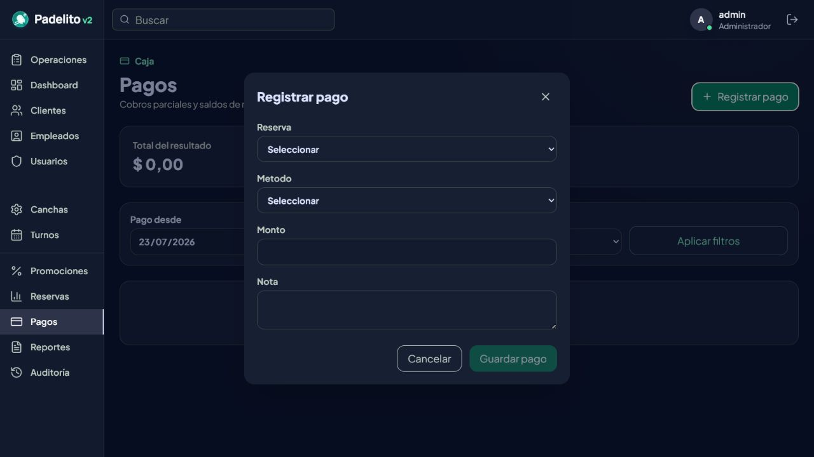

# Padelito v2

**A full-stack operations platform for padel clubs.**

Padelito helps club staff run bookings, payments, customer records, and daily
operations from one role-protected back office. It combines a React SPA with an
ASP.NET Core API and a SQL Server data model designed around operational and
financial consistency.


## The problem

Padel clubs coordinate a deceptively complex daily operation. Staff need to know
which courts are available, prevent conflicting bookings, collect partial or full
payments, apply promotions, and keep a reliable history of every change.

When these workflows live in spreadsheets, chat messages, and disconnected
tools, clubs face recurring problems:

- Double bookings and overlapping court schedules.
- Unclear balances and accidental overpayments.
- Slow check-in, payment, and reservation status workflows.
- Limited visibility into revenue, occupancy, and demand.
- No trustworthy answer to who changed a reservation and when.
- Different access requirements for administrators, receptionists, and staff.

## The solution

Padelito centralizes the club's operational workflow in a single application. A
staff member can move from today's schedule to booking management, payment
collection, reporting, and audit history without changing tools.

The product is intentionally an internal operations system rather than a public
booking marketplace. This keeps the current scope focused on the workflows where
club staff need speed, consistency, and control.

## Product walkthrough

### Reservation operations

Staff can filter active and historical reservations, create bookings from real
availability, collect an outstanding balance, and move a reservation through its
allowed status transitions.


### Payments and balances

Payments can be partial or complete. The payment flow exposes the remaining
balance and prevents concurrent requests from pushing the collected amount above
the reservation total.



### Reporting and auditability

Operational reports bring booked value, collected revenue, and outstanding
balances into the same view. Administrators can trace reservation creation and
status changes back to the responsible user.

| Financial reporting | Reservation audit trail |
| --- | --- |
|  |  |

### Secure staff access

The application provides a dedicated staff login and exposes modules according
to the authenticated user's role.


## Core features

- Daily operations board grouped by court, with upcoming bookings and balances.
- Availability-based booking with conflict prevention and cancelled-slot reuse.
- Controlled reservation lifecycle: pending, confirmed, completed, or cancelled.
- Duration-based pricing and optional date-bound promotions.
- Partial and full payments with live outstanding-balance calculation.
- Revenue, occupancy, demand, cancellation, and promotion analytics.
- Date and status reporting with UTF-8 CSV export.
- Administrative audit trail for reservation creation and status changes.
- Management of clients, employees, users, courts, schedules, and promotions.
- Role-based access for administrators, receptionists, and employees.
- Club-scoped reads and writes to keep tenant data isolated.

## Architecture

The backend follows a layered architecture with dependencies pointing toward the
domain and application contracts:

```text
React SPA
   |
   | HTTP / JSON
   v
Padelito.Api
   |-- Controllers, authentication, authorization, security headers
   |
   v
Padelito.Application
   |-- Use cases, DTOs, business rules, repository interfaces
   |
   +---------------------> Padelito.Domain
   |                       Entities and domain constants
   v
Padelito.Infrastructure
   |-- EF Core, repositories, migrations, production bootstrap
   v
SQL Server
```

| Layer | Responsibility |
| --- | --- |
| `Padelito.Domain` | Core entities and reservation status constants. |
| `Padelito.Application` | Business services, DTOs, validation, and interfaces. |
| `Padelito.Infrastructure` | EF Core persistence, repositories, migrations, and seed data. |
| `Padelito.Api` | HTTP endpoints, dependency injection, JWT authentication, authorization, and production hosting. |
| `frontend` | React application, server-state management, forms, validation, and responsive UI. |

### Technology stack

**Backend:** .NET 10, ASP.NET Core Web API, Entity Framework Core, SQL Server,
xUnit, and Swagger/OpenAPI.

**Frontend:** React 19, TypeScript, Vite, Tailwind CSS, TanStack Query, React Hook
Form, Zod, Lucide icons, and oxlint.

## Technical decisions

### Enforce critical rules twice

The application layer returns clear business errors before writing data, while
the database remains the final authority under concurrency:

- A filtered unique index prevents two active reservations from claiming the
  same date and time slot.
- A SQL Server trigger prevents overlapping active schedules for the same court,
  including writes from another application instance or direct SQL.
- Payment creation runs in a serializable transaction and recalculates the
  committed balance before accepting the payment.

This separates user-friendly validation from correctness guarantees.

### Keep authorization on the server

The frontend hides modules users cannot access, but API policies are the actual
security boundary. JWTs are stored in `HttpOnly`, `SameSite=Strict` cookies;
production cookies are also marked `Secure`. Passwords are stored with ASP.NET
Core's password hasher.

### Make tenant scope explicit

The authenticated user carries a club identifier, and operational repository
queries scope reservations, payments, reports, and audits to that club. Tenant
isolation is therefore enforced in backend queries rather than relying on UI
filters.

### Treat time as a business rule

The club time zone is configurable. Date filters are converted to UTC boundaries
at the application edge so dashboards and payment reports remain consistent with
the club's local operating day.

### Separate server state from UI state

TanStack Query owns API state, loading and error states, and cache invalidation
after mutations. React Hook Form and Zod handle form state and client-side input
validation. The API still validates every business rule.

### Ship the SPA and API as one production artifact

During publish, the API project builds the frontend and includes its `dist`
output in `wwwroot`. ASP.NET Core serves the SPA fallback and API from the same
origin, which simplifies cookie authentication, deployment, and CORS in
production.

## Testing

The backend currently contains 51 passing xUnit tests covering business services
and HTTP integration scenarios, including:

- Login and role-protected endpoints.
- Reservation pricing, availability, conflicts, and status transitions.
- Partial payments, overpayment prevention, and concurrent balance changes.
- Dashboard and report calculations.
- JSON and CSV report responses.
- Club-level data isolation.
- Audit trail creation and filtering.
- Production bootstrap validation.

The frontend is verified through TypeScript compilation, a production Vite
build, and oxlint.

## Run locally

### Prerequisites

- [.NET 10 SDK](https://dotnet.microsoft.com/download)
- [Node.js](https://nodejs.org/) with npm
- A local SQL Server instance

The development configuration expects SQL Server at `localhost` with Windows
integrated authentication and creates/uses a database named `PADELITO_V2_DB`.
Change `backend/Padelito.Api/appsettings.Development.json` if your environment is
different.

### 1. Restore tools and apply migrations

From the repository root:

```bash
dotnet tool restore
dotnet tool run dotnet-ef database update --project backend/Padelito.Infrastructure --startup-project backend/Padelito.Api
```

The migrations create the schema and load a complete demo dataset with clients,
courts, schedules, promotions, reservations, payments, and audit events.

### 2. Start the API

```bash
dotnet run --project backend/Padelito.Api --launch-profile http
```

The API runs at `http://localhost:5211`. Swagger is available at
`http://localhost:5211/swagger` in development.

### 3. Start the frontend

In a second terminal:

```bash
cd frontend
npm ci
npm run dev
```

Open `http://localhost:5173`.

### Demo credentials

```text
Username: admin
Password: admin123
```

## Validate the project

Run the backend build and test suite from the repository root:

```bash
dotnet build backend/PadelitoV2.slnx
dotnet test backend/PadelitoV2.slnx
```

Run the frontend checks from `frontend`:

```bash
npm run lint
npm run build
```

## Repository structure

```text
padelito-v2/
|-- backend/
|   |-- Padelito.Api/
|   |-- Padelito.Application/
|   |-- Padelito.Application.Tests/
|   |-- Padelito.Domain/
|   `-- Padelito.Infrastructure/
|-- frontend/
|-- docs/
|   `-- screenshots/
`-- README.md
```
